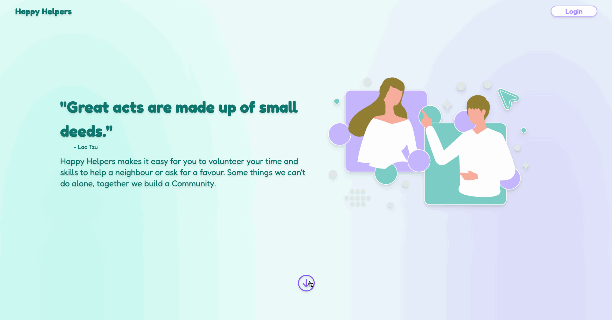
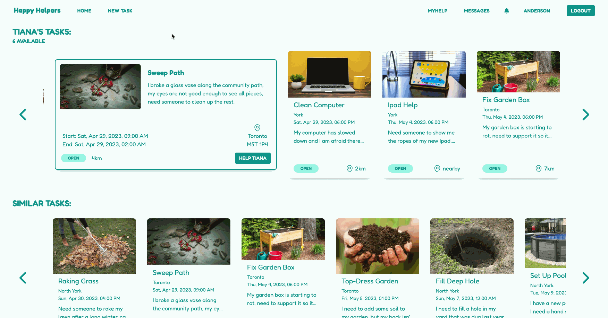
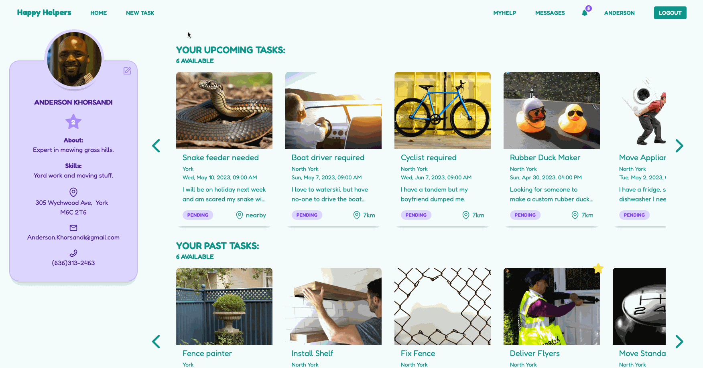
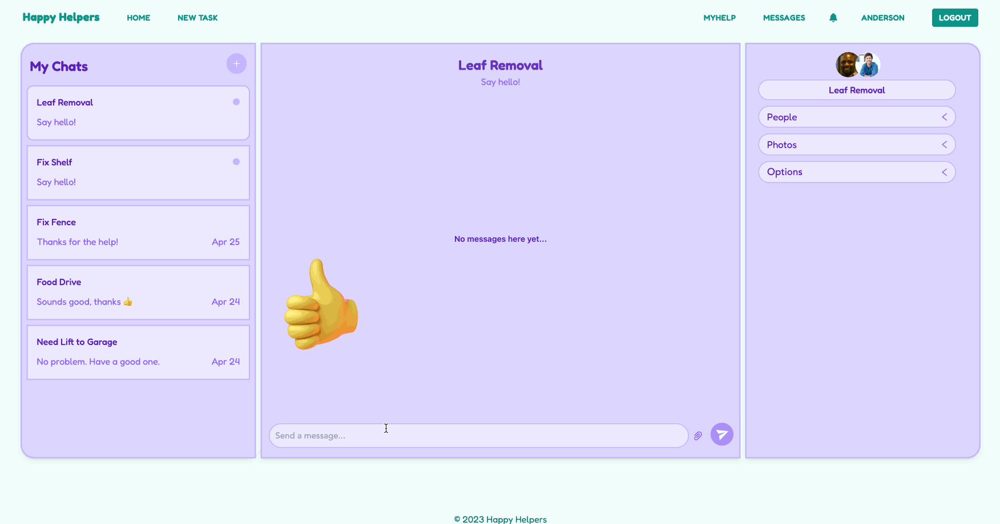

<p align="center" width="100%">
    
</p>
<p align="center" >A crowd-sourcing volunteering app with a focus on building community through in-person interactions and mutual aid. Whether you need a cup of milk from a neighbor, or help to fix a broken door; Happy Helpers can provide you with a volunteer.</p>

<details>
  <summary>Table of Contents</summary>
  <ol>
    <li>
      <a href="#how-it-works">How It Works</a>
    </li>
     <li>
      <a href="#purpose">Purpose</a>
    </li>
    <li>
      <a href="#tech-stack">Tech Stack</a>
    </li>
    <li>
      <a href="#screenshots">Screenshots</a>
    </li>
    <li>
    <a href="#setup">Setup</a>
    </li>
    <li>
    <a href="#dependencies">Dependencies</a>
    </li>
    <li>
    <a href="#project-directory-structure">Project Directory</a>
    </li>
    <li>
    <a href="#contributors">Contributors</a>
    </li>
  </ol>
</details>

## How it Works?

- Users can post a task they need help with or browse upcoming tasks which can be filtered by location, category and date.

- Offering help is simple: just find a task you want to volunteer for and hit OFFER. Once an offer comes in for one of your own tasks, you can view the profiles of the volunteers and select the best match.

- After being accepted for a task, you can view it on your profile page with more information. The embedded Chat Engine lets you ensure that everything is in place as you patiently wait for the day to come to help or be helped by your neighbor.

- Once the task is finished, you can check it complete and reward your volunteer with a star, if deserved. Stars show up on your profile to show others they can rely on you to get the job done!

## Purpose

Happy Helpers has been created by Web Development students John Ross, Sarah Campbell, Alric Fernandes, and Mike Dalton for the Finals project at Lighthouse Labs.

## Tech Stack


[](https://nextjs.org/)
[](https://react.dev/)
[](https://www.prisma.io/)
[](https://www.postgresql.org/)
[](https://nodejs.org/en)
[](https://tailwindcss.com/)

## Screenshots

### The landing page
Find out how the site is designed to bring people together in their communities and either login or sign up for an account:



### The home page
View requests for help in your local area.  Filter and search by category, dates or the distance from your door:


### The new task page
Need a hand? You can easily add a request for help with the New Task form:


### The task page
View all of a user's requests for help and other similar requests to help you decide which tasks to volunteer for.
At the click of a button, you can make a difference:



### The myHelp page
Choose a volunteer from the offers of help for your own requests. Once completed, give the volunteer a star recommendation for a job well done:


### The profile page
Update your profile as your life changes or you learn new skills. Keep an eye on all of your upcoming tasks and see your history of completed tasks:



### The messages page
Chat with your volunteer or requester to make sure everything's in place before the job begins. Then maybe send a message of gratidude after the work has been done:




## Setup

- Clone the project from the GitHub repository <https://github.com/tronross/happy-helpers>.

- Install dependencies with `npm install`.

- Create a `.env.local` file and add your Google Maps Api public key in the form:

  `NEXT_PUBLIC_API_KEY="your key here"`.
  - If needed, you can sign up for a free development account at:

    <https://developers.google.com/maps/documentation/javascript/get-api-key>.

- Create a new PostgreSQL database using `CREATE DATABASE finals`.

- Seed the test data using the Prisma commands:

  `> npx prisma db push --force-reset`

  `> npx prisma db seed`

- Type `> npm run dev` to run the development server.

- Open the page <http://localhost:3000> in your browser and enjoy the site!


## Dependencies


## Project Directory Structure
```
finals
├── planning
└──  prisma
    ├── migrations
    ├── public
    │   └── images
    └── src
        ├── components
        │   └── taskForm
        ├── helpers
        ├── pages
        │   ├── api
        │   │   ├── addresses
        │   │   ├── messages
        │   │   ├── offers
        │   │   ├── organizations
        │   │   ├── tasks
        │   │   ├── offers
        │   │   └── users
        │   ├── profile-page
        │   └── task
        └── styles
```

## Contributors

     **John Ross**

[](https://www.linkedin.com/in/john-ross-9a3345274/) [](https://github.com/tronross)


  **Sarah Campbell**

 [](https://www.linkedin.com/in/sarah-campbell-805569a7/) [](https://github.com/campbell46)


   **Alric Fernandes**

 [](https://www.linkedin.com/in/alric-fernandes-63968a64/) [](https://github.com/alricf)


  **Mike Dalton**

  [](https://www.linkedin.com/in/mike-dalton-4a002224) [](https://github.com/mikedaltonmtl)